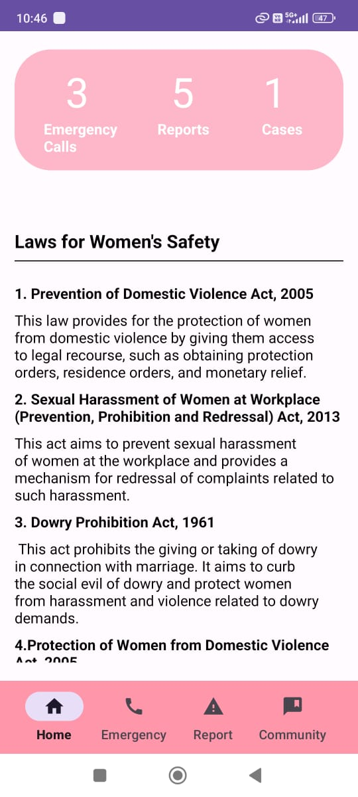
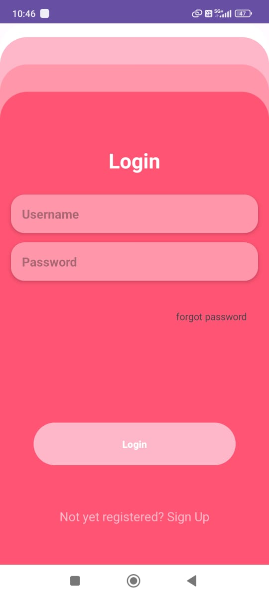
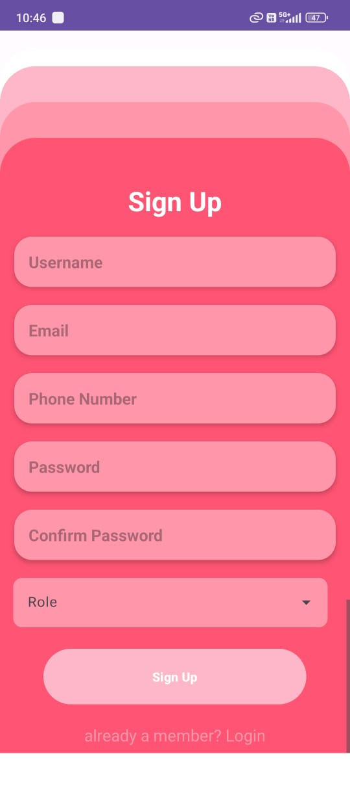
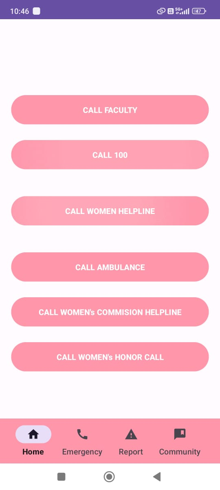
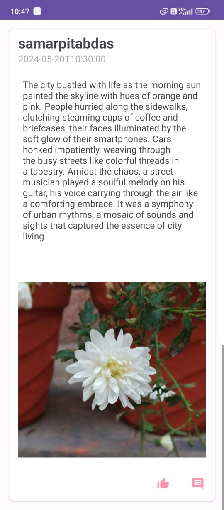
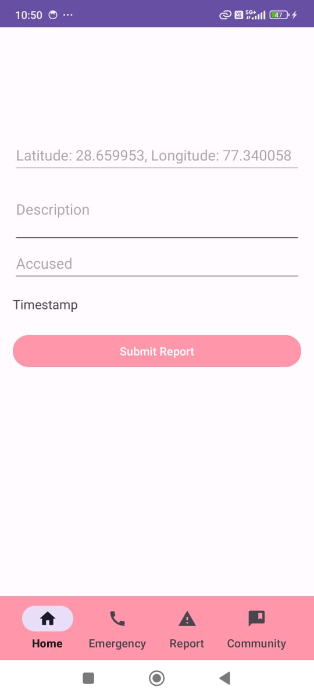

# Raksha: Empowering Women's Safety & Community Support

 

### Raksha is a comprehensive security and monitoring application designed to prioritize the safety of women in educational settings. With a user-friendly interface and powerful features, Raksha ensures a secure environment for students and teachers alike.

 

## Key Features:

### ✨ Differentiated Login:
Raksha offers separate login portals for teachers and students, tailoring the user experience to their specific needs and responsibilities.

### ✨ Quick Emergency Contact:
In times of distress, users can swiftly access emergency contacts with just a tap, connecting them to relevant authorities or support services.

### ✨ Community Posts:
Foster a sense of unity and awareness within the educational community through regular community posts. Share updates, safety tips, and relevant information to empower users.

### ✨ Area Reporting & Mapping:
Raksha utilizes advanced mapping technology to identify and highlight reported areas of concern on the map. This feature aids teachers in promptly addressing issues and implementing necessary measures to enhance security.

### ✨ Emergency Call Routing:
When an emergency call is initiated, Raksha intelligently connects the closest available teacher to the reporter's location, ensuring rapid response and assistance.

 

## Raksha is more than just an application; it's a commitment to fostering a safe and supportive environment where women can thrive without fear. Join us in revolutionizing women's safety in educational institutions with Raksha.

# Screenshots

 

  
  
  
  
  
  

 

# How To Run

### Before Login First Make Sure That The Firebase Database Is Live Else You Won't Be Able To Login.

 

# Team Info
### Samarpita Das [Leader]
### Vaibhav Sharma
